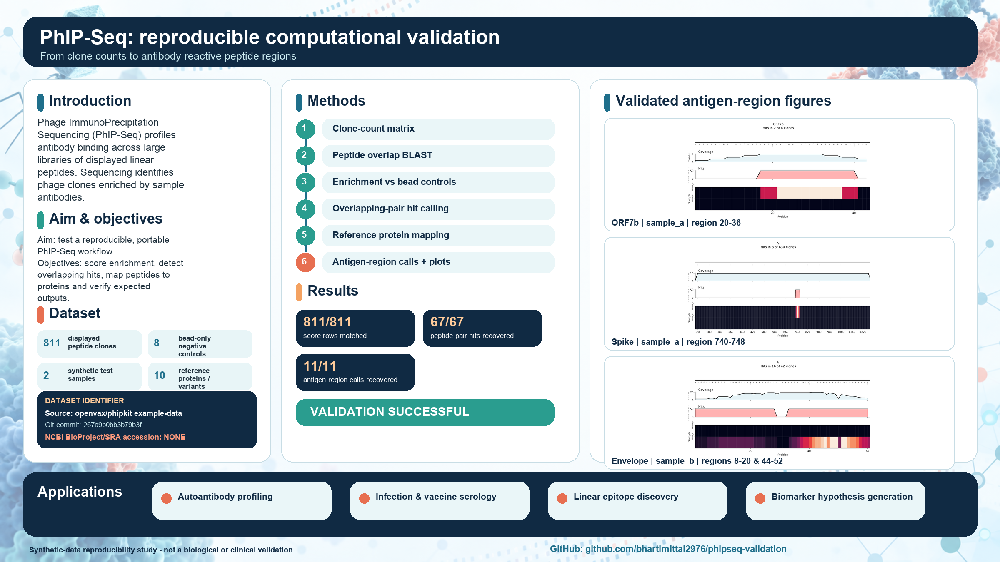
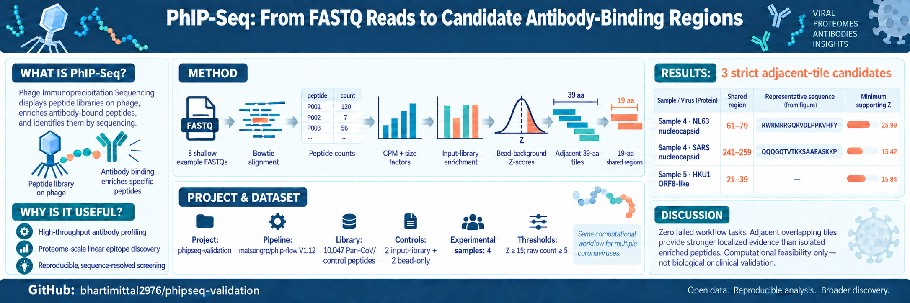

# Reproducible PhIP-Seq validation

This repository contains two complementary computational validations of
Phage ImmunoPrecipitation Sequencing (PhIP-Seq) analysis:

1. An analysis-ready synthetic dataset validation using
   [`openvax/phipkit`](https://github.com/openvax/phipkit).
2. A raw-FASTQ-to-candidate-region validation using the shallow Pan-CoV example
   dataset bundled with [PhIP-Flow](https://github.com/matsengrp/phip-flow).

Together they cover both downstream reference-result reproduction and the
upstream FASTQ alignment/counting stages.



## Validation 1: synthetic analysis-ready dataset

The `phipkit` workflow reproduced all supplied reference results:

- 811/811 peptide enrichment-score rows matched.
- 67/67 expected overlapping peptide-pair hits were recovered.
- 11/11 expected antigen-region calls were recovered.
- Four nonredundant antigen regions were identified across two synthetic samples.
- A three-page antigen visualization was generated for ORF7b, Spike, and Envelope.

### Requirements

- macOS or Linux
- [micromamba](https://mamba.readthedocs.io/en/latest/installation/micromamba-installation.html)
- Git

### Run

```bash
micromamba create -f environment.yml
micromamba activate phipseq
bash scripts/run_analysis.sh
```

A successful run ends with:

```text
PASS: 811 enrichment-score rows match
PASS: 67/67 expected peptide-pair hits recovered
PASS: 11/11 expected antigen-region calls recovered
VALIDATION SUCCESSFUL
```

Validate existing results without rerunning the analysis:

```bash
python scripts/validate_results.py
```

### Outputs

- `results/scores.csv`: enrichment scores relative to bead-only controls
- `results/hits.csv`: significant overlapping peptide-pair hits
- `results/antigens.csv`: consolidated antigen-region calls
- `results/antigens.pdf`: three-page antigen-region visualization

## Validation 2: FASTQ-to-candidate Pan-CoV workflow



This workflow uses the eight shallow example FASTQ files supplied with
PhIP-Flow V1.12:

- two input-library controls;
- two bead-only controls;
- four antibody-containing experimental samples.

The peptide library contains 10,047 Pan-CoV and control peptide records.
PhIP-Flow supplies the example sample table, FASTQ files, and peptide table.

The workflow performs sample and library validation, Bowtie alignment,
SAM-to-peptide counting, alignment QC, CPM and size-factor normalization,
input-library fold enrichment, bead-background Z-score modelling, adjacent
tile detection, and candidate-region visualization.

The final Nextflow run completed with no failed, aborted, pending, or running
tasks.

### Requirements

- macOS or Linux
- Docker
- Java 17 or later
- Nextflow 25.10.4
- Python 3

PhIP-Flow V1.12 was run with Nextflow 25.10.4 because Nextflow 26's stricter
parser rejects legacy top-level syntax in that workflow release.

### Install the project-local Nextflow version

```bash
mkdir -p tools
cd tools
curl -s https://get.nextflow.io | NXF_VER=25.10.4 bash
mv nextflow nextflow-25.10.4
chmod +x nextflow-25.10.4
cd ..
```

The downloaded executable is ignored by Git.

### Run PhIP-Flow

```bash
mkdir -p run-pan-cov
cd run-pan-cov

../tools/nextflow-25.10.4 run matsengrp/phip-flow \
  -r V1.12 \
  -profile docker \
  --run_edgeR false \
  --run_BEER false \
  --run_cpm_enr_workflow true \
  --run_zscore_fit_predict true \
  -resume
```

edgeR and BEER are optional analyses and were not used in this validation.

### Call adjacent candidate regions

The library uses 39-amino-acid peptide tiles beginning 20 positions apart, so
adjacent tiles share a 19-amino-acid sequence.

```bash
cd ..

python3 scripts/call_candidate_regions.py \
  --wide-dir run-pan-cov/results/wide_data \
  --out run-pan-cov/results/candidate_regions-z15.csv \
  --min-z 15 \
  --min-count 5 \
  --tile-step 20

python3 scripts/plot_candidate_regions.py \
  --wide-dir run-pan-cov/results/wide_data \
  --candidates run-pan-cov/results/candidate_regions-z15.csv \
  --out run-pan-cov/results/candidate_regions-z15.svg
```

Both scripts use only the Python standard library.

### Strict candidate calls

At `Z >= 15` and raw count `>= 5`, three collapsed adjacent-tile regions were
identified:

- Sample 4: NL63 nucleocapsid, shared region 61-79.
- Sample 4: SARS nucleocapsid, shared region 241-259.
- Sample 5: HKU1 ORF8-like protein, shared region 21-39.

Repeated strain annotations and shared 1a/1ab sequences are collapsed so that
redundant library records are not counted as independent discoveries.

### Outputs

- `run-pan-cov/results/candidate_regions.csv`
- `run-pan-cov/results/candidate_regions-z15.csv`
- `run-pan-cov/results/candidate_regions-z15.svg`

Regenerable Nextflow work files, logs, wide matrices, binary datasets,
downloaded executables, raw FASTQ files, and machine-specific configuration are
excluded from Git.

## Scope and limitations

These are computational reproducibility exercises, not biological or clinical
validation studies. They do not validate phage-library construction,
immunoprecipitation, patient antibodies, binding affinity, clinical
significance, or biological specificity. The Pan-CoV FASTQs contain a shallow
subset of reads, and large fold-enrichment values can result from low peptide
representation in input-library controls. Candidate regions require independent
experimental validation.

## Data and software provenance

The synthetic inputs and expected outputs under `data/` come from the
Apache-2.0 licensed
[`openvax/phipkit` example dataset](https://github.com/openvax/phipkit/tree/master/example-data).
That analysis uses `phipkit` revision
`267a9b0bb3b79b3ff416e07ce390e43b84a02be4`.

The FASTQ workflow uses the Pan-CoV example data distributed with PhIP-Flow
V1.12.

## References

- Larman HB et al. *Autoantigen discovery with a synthetic human peptidome.*
  Nature Biotechnology (2011). <https://doi.org/10.1038/nbt.1856>
- Mohan D et al. *PhIP-Seq characterization of serum antibodies using
  oligonucleotide-encoded peptidomes.* Nature Protocols (2018).
  <https://doi.org/10.1038/s41596-018-0025-6>
- Galloway J et al. *phippery: a software suite for PhIP-Seq data analysis.*
  Bioinformatics Advances (2023). <https://doi.org/10.1093/bioadv/vbad104>
